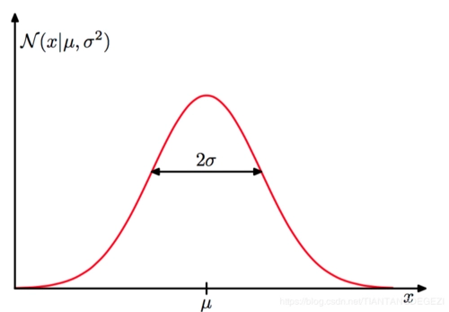

### 极大似然估计，贝叶斯估计，最大后验估计

#### 前言：

​	==概率==和==似然==是一个东西吗？概率对应的英文单词为“probability”，似然对应的英文单词为“likelihood”，两者研究的就像是一枚硬币的正反面。

​	概率研究的问题是：**已知有一个模型和对应的参数，如何预测该模型产生的结果，比如结果的均值，方差等**。以**养猪**来举例子，猪是我们选择的模型，我已经确定好了想养的品种，喂养的方式，猪棚的搭建等等，这就相当于已经确定了模型的参数，预测养出来的猪有多肥，能卖到什么价格就是预测该模型的结果。

​	似然研究的问题是：**现在获得了一堆数据，想要反推这堆数据是通过什么样的模型和参数获得的**。仍以养猪为例，现在笔者手上有一批猪，我认真调研了这些猪的体重，健康状况，毛发等特征，可以在一定程度上推断出这些猪的品种以及之前的生活状况，这一过程就是根据已有数据推断模型和参数的过程。

#### 贝叶斯估计想表达什么？

先摆上贝叶斯公式：
$$
P(A|B)=\frac{P(B|A)P(A)}{P(B)}
$$
其中$P(B|A)$​​为条件概率，$P(A),P(B)$​​为边缘概率。对$B$​​的边缘概率进行展开$P(B)=P(B|A)P(A)+P(B|\sim A)P(\sim A)$​​​,​其中$\sim A$​表示“非$A$​”,即考虑$A$的所有情况下，$B$中的某一类发生的概率。

相应地，贝叶斯公式可以改写为：
$$
P(A|B)=\frac{P(B|A)P(A)}{P(B|A)P(A)+P(B|\sim A)P(\sim A)}
$$
**贝叶斯公式实际上是在描述：你有多大把握可以相信一个证据？**（在这里主观上将$A$理解为条件，$B$理解为结果）

假设随机变量$A$表示“汽车是否被砸”，对应两种分类：是和不是；随机变量$B$表示“警报是否响了”，对应分类为：响和不响。贝叶斯公式的目的是计算警报是否鸣响的两种情况下，汽车被砸或者不被砸的概率。为了方便，我们将$A$表示为是，$\sim A$表示不是。现在要计算等式左边$P(A|B)$的概率，即在警报响了的条件下，汽车也确实被砸了的概率，转到公式右边，$P(B|A)P(A)$表示“汽车被砸发生的概率”与“已知汽车被砸，警报响”的概率乘积，而分母$P(B|A)P(A)+P(B|\sim A)P(\sim A)$则是$A$发生的条件下$B$发生的概率，和$A$不发生的条件下$B$发生的概率之和，换言之就是$B$发生的概率（因为$B$一定与$A$​的某种类别有关联），所以实际上，**贝叶斯公式是要计算在所有的$B$发生的情况中，由$A$​所引起的概率是多大**，对应到公式左边的条件概率的含义就很明显了。

再思考一下，如果想让$P(A|B)=1$,应该怎么做呢？根据等式右边，只要使得$P(B|\sim A)P(\sim A)=0$就可以了，也就是说，在$A$的其他情况发生的时候，$B$都不会发生，这样对于某一种情况$A$,此时$B$一定会发生。（实际中两个随机变量都会有多种类别，按照$P(A|B_i)$理解可能会更好）

从这个角度来思考，**做判断的时候，要考虑所有条件**，警报拉响，不一定是汽车被砸，也有可能是被行人碰了一下。

#### 似然函数

在前言中已经解释了似然和概率的区别，这里再理解似然函数就轻松了。
$$
P(x|\theta)
$$
其中$\theta$表示模型的参数，如果$\theta$是已知的，$x$是变量，即已知模型和参数，求解会出现什么样的样本，称为概率函数（probability function）;==如果$x$是已知的，$\theta$是变量，即根据已有的样本推断模型和参数，称为似然函数（likelihood function）==。

#### 最大似然估计（Maximum Likelihood Estimation，MLE）

最大似然估计的目的就是尽可能求得已知样本分布下，最合适的模型和参数是什么。以一个例子来理解：现在手上有一枚硬币，想知道它是否均匀（即正反面出现的机率是否为$\frac{1}{2}$，这里的均匀就是指硬币的参数），通过大量的测试实验，我们可以估计它。我们拿这枚硬币抛了10次，得到的结果是：反正正正正反正正正反。现在要计算模型正面朝上的概率，设为$\theta$，那么该样本分布（结果分布）对应的似然函数如何计算？
$$
f(x_0,\theta)=(1-\theta)\theta\theta\theta\theta(1-\theta)\theta\theta\theta(1-\theta)=\theta^7(1-\theta)^3
$$
最大似然估计，就是尽可能使上面的概率最大化，这样才能确保在该参数下是最有可能得到这个结果的，至于怎么最大化，当然是最常用的导数求极值了。计算出来之后$\theta=0.7$,也就是说，根据我这10次的实验结果，可以推断出模型不均匀，且正面朝上的概率为0.7.

#### 最大后验概率估计（Maximum a posteriori Estimation，MAE）

如果说最大似然估计是在已知数据分布的情况下求解参数使得$P(x_0|\theta)$最大,即什么样的参数能得到当前的数据结果，那么最大后验概率估计就相当于在原来的基础上乘上一个惩罚项，求解$P(x_0|\theta)P(\theta)$最大时对应的$\theta$，也就是说，求得的参数应该不仅保证$P(x_0|\theta)$尽量大，还应该保证$P(\theta)$也尽量大，这里还是以硬币的例子解释，在自然界存在着很多的硬币，其中绝大多数的硬币都是均匀的，即正面朝上的概率是$\frac{1}{2}$，也有少量的硬币没加工好，不符合这个参数设定。也就是说对于边缘概率$P(\theta)$来说，$\theta=\frac{1}{2}$时有最大值，这就是为什么我们经常使用高斯分布做分布假设的原因，**反映到现实中就是：绝大多数都是普通人，极好的和极差的都属于少数**，附赠一张高斯分布的图：

实际计算中，我们通常假设$P(\theta)$是一个高斯分布的密度函数，对于上面投硬币的例子，我们其实先验地知道，这枚硬币正面朝上的概率很有可能是0.5，即假定$P(\theta)=\frac{1}{\sigma\sqrt{2\pi}}exp(-\frac{(\theta-\mu)^2}{2\sigma^2})$,其中，$\mu=0.5,\sigma=0.1$,则优化变成了对于函数$P(x_0|\theta)P(\theta)$的优化，其中只有$\theta$为未知量。

对函数进行求导计算可得函数取得极值时对应的$\theta=0.558$,更靠近先验的假设，同时又顾及了实验结果。当然，如果有个人顽固的认为所有的硬币都应该是均匀的，即$P(\theta=0.5)=1$,这就像一个冲激函数，只保留$P(x_0|\theta)P(\theta)$在$\theta=0.5$处的值，那么无论做多少次实验，都不会改变结果，因为函数已经变成了一个值，而不是一种分布。