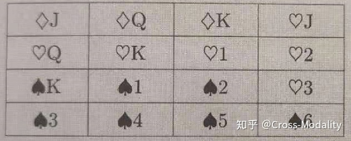
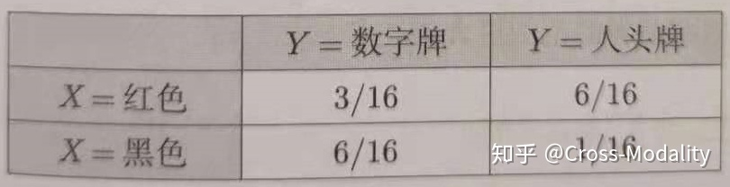

### 联合概率，条件概率，边缘概率

#### 前言：

​			在监督学习中假设输入与输出的随机变量$X$​, $Y$​ 遵循==联合概率分布== $P(X,Y)$, 由此，什么是==联合概率==？

#### 联合概率：

​		从一个例子说起：

现在我们要将其分成两个随机变量，每个随机变量都包含两个类别，其中一个随机变量为$X$,类别是==红色和黑色==，另一个随机变量是$Y$,类别是==数字牌和人头牌==，分别统计所有的类别在整体中所占的比例，可以得到以下结果：

对于随机变量$X$,按照颜色划分是$p(X=红色)(9/16) + p(X=黑色)(7/16)=1$，对于随机变量$Y$,按照牌的类别划分$p(Y=数字牌)(9/16) + p(Y=人头牌)(7/16)=1$，所以根据结果给出**联合概率的定义：既满足$X$条件，又满足$Y$​条件的概率**。两个条件的满足位于==同一起跑线==上，同时每个变量下的所有类别对应的概率之和为1.

#### 条件概率：

（个人认为）可以这样理解：如果说联合概率是建立在整个整体上，那条件概率就是建立在整体的一部分中，比如说 $P(Y=数字牌 | X=红色)$ 这个条件概率就是将整体（也就是分母）建立在 $X=红色$ 这一部分中，而红色这部分的总数为9，在这9张中计算满足$Y=数字牌$​ 的概率，因此是$3/9$​.

条件概率的计算公式：
$$
P(Y|X)=\frac{P(XY)}{P(X)}
$$
公式的右侧均是以整体为分母，$P(XY)$​​​​表示$X,Y$​​​​同时发生的概率,$P(X)$​​​为边缘概率，下面会介绍。计算过程$P(XY)=\frac{3/16}{9/16}=\frac{3}{9}$。

#### 边缘概率：

边缘概率是相对于联合概率而言的​，即从单一的随机变量的角度考虑，比如计算$X$​的边缘概率，只考虑$X$​中的不同类别出现的概率，这个整体所对应的分母仍是以整体的所有随机变量为分母，即$P(X=红色)=9/16,p(X=黑色)=7/16$，也就是说，不考虑其他的剩下的随机变量，只看当前的变量对应的类别在整体中的分布。​​

