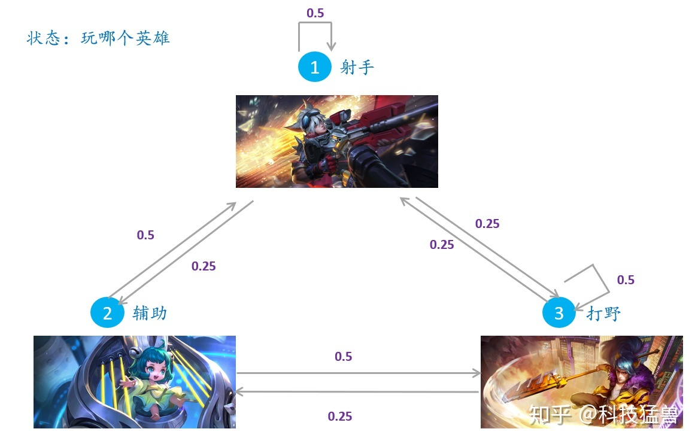

### 马尔科夫链，蒙特卡洛（上篇）

#### 蒙特卡罗方法

蒙特卡洛估计圆周率$\pi$的值

$\pi=\frac{4N}{3000}$，其中$N$是放在圆内部的数据点次数。

**蒙特卡洛的使用场景：**当所求解的问题是某种随机事件出现的概率，或者是某个随机变量的期望值时，通过某种"实验"，以事件出现的概率作为随机事件的概率（落在圆内的概率等），或者得到这个随机变量的某些数字特征（积分值，净利润），并将其作为问题的解。

当需要求解某个参量的时候，直接求解遇到了困难，那我就构造一个合适的概率模型，对这个模型进行大量的采样和统计实验，使它的某些参量正好是待求问题的解，此时，只需要把这个参量的值统计出来，那么问题的解就得到了估计值。

#### 随机抽样

假设概率分布的定义已知，通过抽样获得概率分布的随机样本，并**通过得到的随机样本对概率分布的特征进行分析**，比如，从样本得到经验分布，从而估计总体分布，或者从样本计算出样本均值，从而估计总体期望，所以蒙特卡罗的核心是**随机抽样**。

**马尔可夫方法的一般形式：**

求解积分：$S=\int _a^b f(x)dx$

如果很难求出$f(x)$的具体表达式，那么我们就需要用到蒙特卡洛方法，你可以在一个矩形区域中洒1000个点，统计落在积分区域的个数，或者也可以换下面的方法：
$$
S=\int _a^b f(x)dx=\int _a^b p(x)\frac{f(x)}{p(x)}dx=E_{x\sim p(x)}[\frac{f(x)}{p(x)}]
$$
上式的改动可以这样去理解，原式变成了一个对$\frac{f(x)}{p(x)}$的期望，该期望服从的分布是$p(x)$​，这个分布可以是任何一种（因为能这样表示肯定是始终成立的，换句话说，什么分布跟结果没有关系）。

如果想估计这个期望值，就需要按照概率分布$p(x)$​**独立**地抽取$n$个样本。辛钦大数定律：
$$
当 n\to \infty 时，\frac{1}{n}\sum_{i=1}^n\frac{f(x_i)}{p(x_i)}\to E_{x\sim p(x)}[\frac{f(x)}{p(x)}]
$$
意思是：当采样的数量足够多的时候，原式的期望可以通过大量样本的观察统计来近似

现在的问题转到了如何按照$p(x)$采样若干个样本，但是很多情况下我们并不知道$p(x)$的分布，按照其分布采样并不容易实现

##### 抽样方法1：拒绝-接受采样

> 适用于$p(x)$​极度复杂不规则的情况
>
> 插句题外话：**什么叫从概率分布中采样？**采样是从总体中抽取一部分样本集，不过，每个样本被抽取到的概率是不一样的，这些概率放在一起就是概率分布。更具体一点地：假设现在有一堆样本服从高斯分布，纵坐标代表样本值，横坐标代表出现的概率，当你进行大量的取出-记录-放回之后，会发现期望中间的样本被抽到的次数最多，将抽到的这些样本以及次数统计起来，可以近似拟合高斯的分布。

$p(x)$无法直接采样时，可以用一个能够直接采样的分布$q(x)$作为媒介，称为**建议分布**，常用高斯分布，并且它的$c$倍一定$\geq p(x)$,其中$c>0$,如下图：

具体的做法是：首先按照$q(x)$进行采样，比如说采样得到$x^*$，这个时候会以一定的概率保留它，保留的概率是：
$$
\frac{p(x^*)}{cq(x^*)}
$$
相应地，舍弃它的概率是：
$$
1-\frac{p(x^*)}{cq(x^*)}
$$
这样做的结果是：保留下来的每一个$x^*$都相当于是按照$p(x)$采样得到的了，直到完成采样$n$个样本。

**为什么这样可以？**

本身在采样的时候是按照$cq(x^*)$的概率采样的，然后再以$\frac{p(x^*)}{cq(x^*)}$的概率保留，所以实际上是以$cq(x^*)\times \frac{p(x^*)}{cq(x^*)}=p(x^*)$的概率采样，正符合预期。

##### 抽样方法2：重采样技术（reparameterization trick）

这种方法经常用于自编码，为了让网络能够完成反向传播，具体这样：
 现在要从$N(\mu,\sigma^2)$中采样一个$Z$,相当于从$N(0,1)$中采样一个$\epsilon$,然后让$Z=\mu+\epsilon\times \sigma$

于是，我们将从$N(\mu,\sigma^2)$采样变成了从$N(0,1)$中采样，之后通过参数变换得到了从$N(\mu,\sigma^2)$中采样的结果，这样“采样”的操作就不用参与梯度下降了。

==要想将蒙特卡洛方法做为一个通用的采样模拟求和的方法，必须解决如何方便得到**各种复杂概率分布的采样样本集**的问题==，所以就有了马尔可夫链的诞生

#### 马尔科夫链

>**万物先从定义出发，什么是马尔科夫链？**
>
>考虑一个随机变量的序列$X=\{X_0,X_1,...,X_t,...\}$,这里的$X_t$表示时刻$t$的随机变量，$t=0,1,2,...$.每个随机变量$X_t$的取值集合相同，称为状态空间，表示为$S$​。随机变量可以是离散的，也可以是连续的。以上随机变量的序列构成**随机过程（stochastic process）**
>
>假设在时刻0的随机变量$X_0$遵循概率分布$P(X_0)=\pi_0$,称为初始状态分布，在某个时刻$t\geq 1$的随机变量$X_t$与前一个时刻的随机变量$X_{t-1}$之间有条件分布$P(X_t|X_{t-1})$，如果$X_t$只依赖于$X_{t-1}$，而不依赖于过去的随机变量$\{X_0,X_1,...,X_{t-2}\}$​,这一性质称为马尔科夫性，即：
>$$
>P(X_t|X_{t-1},X_{t-2},...,X_{0})=P(X_t|X_{t-1}),t=1,2,...
>$$
>具有马尔可夫性的随机序列$X=\{X_0,X_1,...,X_t,...\}$称为马尔科夫链（Markov chain），或者马尔可夫过程，条件概率分布$P(X_t|X_{t-1})$称为**马尔科夫链转移概率分布**。

如果这个条件概率分布与具体的时刻$t$无关，则称其为时间齐次的马尔科夫链。

定义**转移概率矩阵**：
$$
\begin{bmatrix} &p_{11} &p_{12} &p_{13}\\
				&p_{21} &p_{22} &p_{23} \\
				&p_{31} &p_{32} &p_{33}\end{bmatrix}
$$
其中$p_{ij}=P(X_t=i|X_{t-1}=j)$

定义**马尔科夫链在$t$时刻的概率分布称为$t$时刻的状态分布**：
$$
\pi(t)=\begin{bmatrix}&\pi_1(t) \\
					  &\pi_2(t) \\
					  &\pi_3(t)\end{bmatrix}
$$
其中$\pi_i(t)=P(X_t=i),i=1, 2,...$,$i$表示某种状态

特别地，马尔科夫链的初始状态分布可以表示为：
$$
\pi(0)=\begin{bmatrix}&\pi_1(0) \\
					  &\pi_2(0) \\
					  &\pi_3(0)\end{bmatrix}
$$
通常初始分布$\pi(0)$向量只有一个分量是1，其余分量都是0，表示马尔科夫链从一个具体状态开始。

有限离散状态的马尔科夫链可以用有向图表示，节点表示状态，边表示状态之间的转移，边上的数值表示转移概率，从一个初始状态出发，根据有向边上定义的概率在状态之间随机跳转，就可以产生状态的序列，**马尔科夫链实际上是刻画随时间在状态之间转移的模型，假设未来的转移状态只依赖于现在的状态，而与过去的状态无关**

如下面的例子中，转移概率矩阵为
$$
P=\begin{bmatrix}&0.5 &0.5 &0.25 \\ 
				&0.25 & 0 & 0.25 \\
				&0.25 & 0.5 &0.5\end{bmatrix}
$$

$p_{11}=0.5$表示：当现在的状态为1时，有$0.5$的概率下一个状态还是1，以此类推。

任意假设一个初始状态：设初始的三个概率分别是$\begin{bmatrix}&0.5 &0.3 &0.2 \end{bmatrix}$,即在$t=0$时刻，50%概率选择射手，30%概率选择辅助，20%概率选择打野，下一时刻的三种状态的概率可以通过与转移概率相乘得到，即$S_1=PS_0^T$,连续计算足够长的时间之后，会发现玩家最后选择射手，辅助，打野的概率趋近于$\begin{bmatrix} &0.4 &0.2 &0.4 \end{bmatrix}$.

**是不是所有的马尔科夫链都有平稳分布？**

不是的，必须满足下面的定理：

>给定一个马尔科夫链$X=\{X_0,X_1,...,X_t,...\}$,$t$时刻的状态分布：$\pi=(\pi_1,\pi_2,...)$是$X$的平稳分布的条件是$\pi=(\pi_1,\pi_2,...)$是下列方程组的解：
>$$
>x_i=\sum_jp_{ij}x_j,i=1,2,...\\
>其中x_i\geq 0,i=1,2,...\\
>\sum_i x_i=1
>$$

**马尔可夫链的性质**

* 不可约

>一个不可约的马尔科夫链，从任意状态出发，经过充分长时间后，可以到达任意状态
>
>**定义：**给定一个马尔科夫链$X=\{X_0,X_1,...,X_t,...\}$,对于任意的状态$i,j\in S$,如果存在一个时刻$t$满足：$P(X_t=i|X_0=j)>0$,也就是说，时刻0从状态$j$出发，时刻$t$到达状态$i$的概率大于0，则称$X$是**不可约**的，否则称为可约的。

* ==非周期==（没太理解）

> 一个非周期的马尔科夫链，意味着对于所有的状态，从一个时刻到下一个到达相同状态的时刻之间不呈现周期性
>
> 给定一个马尔科夫链$X=\{X_0,X_1,...,X_t,...\}$，对于任意的状态$i\in S$,如果时刻0从状态$i$出发，$t$时刻返回该状态，在此过程中的时间总长$\{t:P(X_t=i)|X_0=i)\}$的最大公约数为1，称其为**非周期的**。​

**定理：不可约且非周期的有限状态马尔科夫链，有唯一平稳分布存在**

#### 马尔可夫链的一些定义

* 首达时间：

  $T{ij}=min\{n:n\geq 1,X_0=i,X_n=j\}$表示从状态$i$出发首次到达状态$j$的时间，若状态$i$出发永远不能到达状态$j$，则$T_{ij}=+\infty$

* 首达概率：
  $$
  f_{ij}=P(X_n=j,X_m\neq j,m=1,2,...,n-1|X_0=i)
  $$
  $f_{ij}^{(n)}$为从状态$i$出发经过$n$步首次到达状态$j$的概率

  $f_{ij}^{+\infty}$为从状态$i$出发永远不能到达状态$j$的概率

* 从状态$i$出发经过有限步首次到达状态$j$的概率
  $$
  f_{ij}=\sum_{n=1}^{+\infty}f_{ij}^{(n)}=P(T_{ij}<+\infty)
  $$
  如果状态$i$为常返态，则$f_{ii}=1$，即有限步一定能回来

* 平均返回时间
  $$
  \mu_i=\sum_{n=1}^{+\infty}nf_{ii}^{(n)}
  $$
  如果$i$是常返态，且$\mu_i<+\infty$,称为正常返；若$\mu_i=+\infty$，称其为零常返

* 遍历态：

  $i$既是正常返，又是非周期

  

  直观上，一个正常返的马尔科夫链，其中任意一个状态，从其他任意一个状态出发，当时间趋于无穷时，首次转移到这个状态的概率不为0。

**这里插一句，什么是平稳过程？如何用数学来表示？**

现有如图所示的一个**集合**，中间包含无数条随机历程或样本$x_1(t),x_2(t),...,x_n(t)$

平稳随机过程(stationary process)的含义是该集合的**概率分布函数**$p(x(t))$与时间$t$无关，如在时刻$t_1$，$p(x(t_1))$呈以下分布，那么在任意时刻$t_m$，概率分布函数$p(x(t_m))$都长这样，它是与时间无关的。

**对于马尔科夫链的平稳分布是什么？**

当时间足够长的时候，每个时刻的状态分布会趋向一个定值，该分布就是马尔科夫链的平稳分布。

#### 总结

**1. 理解马尔科夫链时一定要与时间的关系区分开，马尔科夫链描述的是状态间的转移关系，不是时间关系，至于它的一些性质，是通过时间尺度来衡量的，而本身并不是对时间的描述。**

**2. 平稳分布的意思是，状态分布的统计特性不随时间变化，或者说，状态分布本身不随时间发生变化，如何理解状态分布？**

**3. 回顾平稳分布的充要条件：在一个状态转移图中，每种状态出现的概率大于零，且所有状态的概率之和为1.**

**4. 遍历定理：不可约，非周期且正常返的马尔科夫链，有唯一平稳分布存在，并且转移概率的极限分布是马尔科夫链的平稳分布。**
$$
\lim_{t\to +\infty}P(X_t=i|X_0=j)=\pi_i,i=1,2...;j=1,2,...
$$
