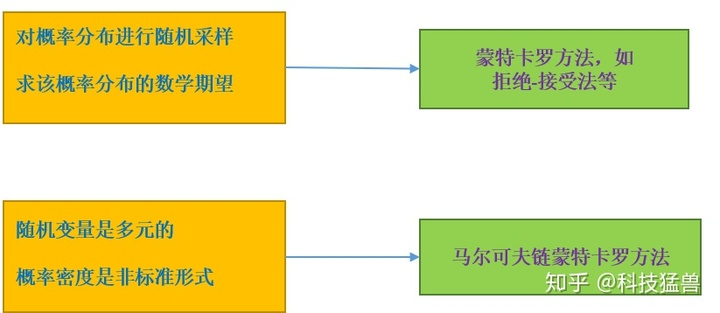

### 马尔科夫链，蒙特卡洛（下篇）

#### 前言

上篇的核心思想：



一般的采样问题，以及期望求解，数值近似问题，蒙特卡罗方法都能很好的解决，但遇到多元变量以及复杂的概率密度时，仅仅使用蒙特卡洛方法不足以解决这个问题，此时就需要两者的联合。

**定义：**

$\pi_i=\pi(i)=\lim_{t\to +\infty}P(X_t=i)$表示马尔科夫链到达平稳状态的时候，状态位于第$i$个状态的概率。

**两者如何结合在一起？**


还是利用上篇的王者荣耀举例，定义一个满足遍历定理的马尔科夫链$X=\{X_0,X_1,...X_t,...\}$​，每一个状态代表在王者荣耀里玩哪个英雄，比如初始状态$X_0=1$​代表玩射手，$X_0=3$​是玩打野等。

满足遍历定理->平稳分布就是指当$t\to +\infty$时，选择哪一个英雄的概率分布。


**现在要解决什么问题？**

1. 从一个目标分布$p(x)$中进行抽样
2. 求出$f(x)$的数学期望$E_{x\sim p(x)}[f(x)]$

假设：王者荣耀马尔可夫链的平稳分布=目标分布$p(x)$

在王者荣耀这个马尔可夫链上游走一次，对应的状态就相当于从目标分布$p(x)$中进行抽样1个样本，换句话说，比如王者荣耀平稳分布是$[0.5, 0.2, 0.3]$，目标分布也应该是$[0.5, 0.2, 0.3]$，那么，在马尔可夫链上游走1次，比如说这把选了辅助，就相当于是在$p(x)$中采样了$x_2$。

**所以，每个时刻在这个马尔可夫链上随机游走一次，就可以得到一个样本，根据遍历定理，当时间趋于无穷时，样本的分布趋近平稳分布，样本的函数均值趋近函数的数学期望。**

所以，当时间足够长时（大于某个正整数$m$），在之后的时间里随机游走得到的样本集合${x_{m+1},...,x_n}$就是目标概率分布的抽样结果，得到的函数均值（遍历均值）就是要计算的数学期望值。
$$
\hat Ef=\frac{1}{n-m}\sum_{i=m+1}^nf(x_i)
$$
到时刻$m$为止的时间段称为燃烧期。

马尔科夫链蒙特卡洛法得到的样本序列，相邻的样本点是相关的，而不是独立的。因此，在需要独立样本时，可以在该样本序列中再次进行随机抽样，比如每隔一段时间取一次样本，将这样得到的子样本集合作为独立样本集合。马尔科夫链蒙特卡洛法比接收-拒绝法效率更高，没有大量被拒绝的样本，虽然燃烧期的样本也要抛弃。

**最大的问题是：给了目标分布$p(x)$，对应的王者荣耀马尔科夫链怎么构造？假设收敛的步数为$m$，即迭代了$m$之后收敛，那$m$是多少？迭代步数$n$又是多少**

**马尔科夫链蒙特卡罗方法的基本步骤是：**

1. 构造一个王者荣耀马尔科夫链，使其平稳分布为目标分布$p(x)$

2. 从某个初始状态$x_0$,比如第一把选射手，用构造的马尔科夫链随机游走，产生样本序列，$x_0,x_1,...,x_t,...$

3. 应用遍历定理，确定正整数$m$和$n$，得到平稳分布的样本集合：$\{x_{m+1},x_{m+2},...,x_n\}$，求得函数$f(x)$的均值。
   $$
   \hat Ef=\frac{1}{n-m}\sum_{i=m+1}^nf(x_i)
   $$

#### 如何构造一个王者荣耀马尔科夫链？

比如说已知的目标分布$p(x)$是$[0.5,0.2,0.3]$，想构造一个马尔科夫链，使它的平稳分布也是$[0.5,0.2,0.3]$,关键还是要求出状态转移矩阵：
$$
\begin{bmatrix} 0.5 \\0.2 \\0.3 \end{bmatrix}=P\begin{bmatrix} 0.5 \\0.2 \\0.3 \end{bmatrix}
$$
**定理：满足==细致平衡方程==的状态分布$\pi$就是该马尔科夫链的平稳分布$P\pi=\pi$，**（这句话直接用就可以，先不纠结怎么来的）所以，我只需要找到**可以使状态分布$\pi$满足细致平衡方程的矩阵$P$即可**，即满足：
$$
\pi_iP_{j,i}=\pi_jP_{i,j}
$$
仅仅从细致平衡方程还是很难找到合适的矩阵$P$。比如我们的目标平稳分布是$\pi$​​，随机找一个马尔科夫链状态转移矩阵$Q$,它是很难满足细致平衡方程，即：
$$
\pi_i Q_{j,i}\neq \pi_j Q_{i,j}
$$

#### 马尔可夫蒙特卡洛方法总论

构造一个$\alpha_{ij}$和$\alpha_{ji}$，使上式强制取等号，即：
$$
\pi_i Q_{j,i}\alpha_{j,i}= \pi_j Q_{i,j}\alpha_{i,j}
$$
如果要使上式恒成立，只需要取：
$$
\alpha_{j,i}=\pi_j Q_{i,j} \\
\alpha_{i,j}=\pi_i Q_{j,i}
$$
所以，马尔可夫链的状态转移矩阵：
$$
P_{j,i}=Q_{j,i}\alpha_{j,i} \\
P_{i,j}=Q_{i,j}\alpha_{i,j}
$$
状态转移矩阵$Q$是我们胡乱设的，$\alpha$值是可以根据$Q$和目标分布$p(x)$算出来的，然后$P$就可以求出来了。

$\alpha_{i,j}$的专业术语叫做**接受率**，取值在$[0,1]$之间，可以理解为一个概率值。

状态转移矩阵$Q$​的平稳分布叫做**建议分布**

**此时，问题的演变过程：**

从目标分布$p(x)$中采样

-------> 在马尔科夫链（状态转移矩阵为$P$）中随机游走，当达到平稳分布时，每个时刻随机游走一次，就可以得到一个样本

-------> 在马尔可夫链（状态转移矩阵为$Q$​）中随机游走，当达到平稳分布时，每个时刻随机游走一次，就可以得到一个样本，这时，以一定的接受率获得，与蒙特卡洛中的接受-拒绝采样类似，以一个常见的马尔科夫链状态转移矩阵$Q$通过一定的接受-拒绝概率得到目标转移矩阵$P$。

**梳理一下算法：**

1. 输入我们任意选定的马尔科夫链状态转移矩阵$Q$，平稳分布$\pi$，设定状态转移次数阈值$m$，需要的样本个数$n$。
2. 采样一个初始状态$x_0$
3. 从马尔科夫链$Q$中游走一次采样一个样本$x_*$  
4. 产生一个$[0,1]$均匀分布之间的随机数$u$
5. 如果$u<\alpha_{x_*,x_i}=\pi_{x_*}Q_{x_i,x_*}$，从状态$x_i$到状态$x_*$，则接受转移$x_i\to x_*,x_{i+1}=x_*$，否则不接受转移，即$x_{i+1}=x_i$​
6. 重复步骤3-5直到采样$n+m-1$个样本点，样本集$(x_m,...,x_{n+m-1})$即为平稳分布对应的样本集

#### Metropolis-Hastings（MCMC采样）

**具体过程：**

从目标分布$p(x)$中采样

-------> 在马尔科夫链（状态转移矩阵为$P$​）中随机游走，当达到平稳分布时，每个时刻随机游走一次，就可以得到一个样本

------->  在马尔可夫链（状态转移矩阵为$Q$）中随机游走，当达到平稳分布时，每个时刻随机游走一次，就可以得到一个样本，这时，以一定的接受率获得，与蒙特卡洛中的接受-拒绝采样类似，以一个常见的马尔科夫链状态转移矩阵$Q$通过一定的接受-拒绝概率得到目标转移矩阵$P$。

**这种方式存在的问题：**

接受率$\alpha_{i,j}$的取值在$[0,1]$之间，可以理解为一个概率值，这个值通常很小，导致拒绝率太高了，也就是说在状态转移矩阵为$Q$的马尔可夫链中随机游走，刚得到一个样本就被拒绝了，你还得再游走一次，可能这次的又被拒绝了，这样做的效率非常低，导致燃烧期很长，MCMC方法就可以解决这个问题。

核心公式依然是：
$$
\pi_i Q_{j,i}\alpha_{j,i}= \pi_j Q_{i,j}\alpha_{i,j}
$$
现在让两边的$\alpha$​值同时扩大相同的倍数，等式依然成立，直到其中一侧的$\alpha$​​扩大到1.比如：
$$
\pi_i Q_{j,i}\times0.01= \pi_j Q_{i,j}\times0.05
$$
变为：
$$
\pi_i Q_{j,i}\times0.2= \pi_j Q_{i,j}\times1
$$
现在的接受率实际上是：
$$
\alpha_{j,i}=\min\{\frac{\pi_j Q_{i,j}}{\pi_i Q_{j,i}},1\}\\
\alpha_{i,j}=\min\{\frac{\pi_i Q_{j,i}}{\pi_j Q_{i,j}},1\}
$$
min是要限制接受率不超过1.

**现在的算法流程为：**

1. 输入我们任意选定的马尔科夫链状态转移矩阵$Q$，平稳分布$\pi$，设定状态转移次数阈值$m$，需要的样本个数$n$。
2. 采样一个初始状态$x_0$
3. 从马尔科夫链$Q$中游走一次采样一个样本$x_*$  
4. 产生一个$[0,1]$均匀分布之间的随机数$u$
5. 如果$u<\alpha_{x_*,x_i}=\min\{\frac{\pi_{x_*} Q_{x_i,x_*}}{\pi_{x_i} Q_{x_*,x_i}},1\}$​，从状态$x_i$​到状态$x_*$​，则接受转移$x_i\to x_*,x_{i+1}=x_*$​，否则不接受转移，即$x_{i+1}=x_i$​(实际上就是放弃该采样点)​
6. 重复步骤3-5直到采样$n+m-1$个样本点，样本集$(x_m,...,x_{n+m-1})$即为平稳分布对应的样本集

如果我们选择的马尔科夫链转移矩阵是对称的，即满足$Q_{i,j}=Q_{j,i}$，这时的接受率可进一步简化为$\alpha_{j,i}=\min\{\frac{\pi_j }{\pi_i},1\}$

**该方法采样的python实现：**

```python
'''
假设目标平稳分布是一个均值为10，标准差为5的正态分布，而选择的马尔可夫链状态转移矩阵Q的条件转移概率是以i为均值，方差为1的正态分布在位置j的值
'''
import random
import math
from scipy.stats import norm
import matplotlib.pyplot as plt

def norm_dist_prob(theta):
    y = norm.pdf(theta, loc=10, scale=5)
    return y

T = 5000
pi = [0 for i in range(T)]
sigma = 1
t = 0
while t < T-1:
    t = t + 1
    pi_star = norm.rvs(loc=pi[t - 1], scale=sigma, size=1, random_state=None)   #状态转移进行随机抽样
    alpha = min(1, (norm_dist_prob(pi_star[0]) / norm_dist_prob(pi[t - 1])))   #alpha值

    u = random.uniform(0, 1)
    if u < alpha:
        pi[t] = pi_star[0]
    else:
        pi[t] = pi[t - 1]


plt.scatter(pi, norm.pdf(pi, loc=10, scale=5),label='Target Distribution', c= 'red')
num_bins = 50
plt.hist(pi, num_bins, density=1, facecolor='green', alpha=0.7,label='Samples Distribution')
plt.legend()
plt.show()
```


**补充：**

高斯分布的函数：
$$
f(x)=\frac{1}{\sqrt{2\pi}\sigma}\exp-\frac{(x-\mu)^2}{2\sigma^2}
$$


再假设目标平稳分布是一个$\alpha=2.37,b=0.627$的$\beta$分布，而选择的马尔科夫链状态转移矩阵$Q_{j,i}$的条件转移概率是以$i$为均值，方差为1的正态分布在$j$的值。
$$
f(x,a,b)=\frac{\Gamma(a+b)x_{a-1}(1-x)^{b-1}}{\Gamma(a)\Gamma(b)}
$$

```python

import random
import math
from scipy.stats import beta
from scipy.stats import norm
import matplotlib.pyplot as plt

a, b = 2.31, 0.627

def norm_dist_prob(theta):
    y = beta(2.31, 0.627).pdf(theta)
    return y

T = 5000
pi = [0 for i in range(T)]
sigma = 1
t = 0
while t < T-1:
    t = t + 1
    pi_star = norm.rvs(loc=pi[t - 1], scale=sigma, size=1, random_state=None)   #状态转移进行随机抽样
    alpha = min(1, (norm_dist_prob(pi_star[0]) / norm_dist_prob(pi[t - 1])))   #alpha值

    u = random.uniform(0, 1)
    if u < alpha:
        pi[t] = pi_star[0]
    else:
        pi[t] = pi[t - 1]

plt.scatter(pi, beta(2.31, 0.627).pdf(pi),label='Target Distribution', c= 'red')
num_bins = 50
plt.hist(pi, num_bins, density=1, facecolor='green', alpha=0.7,label='Samples Distribution')
plt.legend()
plt.show()
```


可以看到这种方式对于目标分布的拟合效果还是可以的

#### 吉布斯抽样

M-H采样由于接受率计算式$\min\{\frac{\pi(j)Q(j,i)}{\pi(i)Q(i,j)}\}$的存在，在高维时需要很长的计算时间，效率很低。此外，很多时候我们甚至很难求出目标的各特征维度联合分布，但是方便求出各特征之间的条件概率分布，所以，我们希望对条件概率分布进行抽样，得到样本序列。

吉布斯抽样解决的问题和M-H方法解决的问题是一样的，都是从给定一个已知的目标分布$p(x)$中采样，并估计某个函数的期望值，只不过此时$p(x)$是一个多维的随机分布，$p(x)$的联合分布难以采样，但条件分布会更容易。

> **基本做法：**从联合概率分布定义条件概率分布，依次对条件概率分布进行抽样，得到样本的序列，这样的抽样过程是在一个马尔可夫链上的随机游走，每一个样本对应着马尔科夫链的状态，平稳分布就是目标的联合分布。

假设多元变量的联合概率分布为$p(x)=p(x_1,x_2,...,x_k)$，吉布斯采样从一个初始样本$x^{(0)}=(x_1^{(0)},x_2^{(0)},...,x_k^{(0)})$出发，不断进行迭代，每一次迭代得到联合分布$x^{(i)}=(x_1^{(i)},x_2^{(i)},...,x_k^{(i)})$，最终得到样本序列$x^{(0)},x^{(1)},...,x^{(k)}$

**首先讨论二维的数据分布：**

根据细致平衡方程$\pi_iP_{j,i}=\pi_jP_{i,j}$(这里在重申一下，索引$i,j$指的是状态的索引)，在数据分布是二维的时候，$\pi(x_1,x_2)$就变成了二维联合概率分布，目标分布$p(x)=p(x_1,x_2)$,而且我们希望$\pi(x_1,x_2)=p(x_1,x_2)$

根据条件概率的计算公式：$P(Y|X)=\frac{P(XY)}{P(X)}$

可以把两个变量的二维联合概率分布的条件分布计算出来：
$$
\pi(x_1|x_2)=\frac{\pi(x_1,x_2)}{\int\pi(x_1,x_2)dx_1},
\pi(x_2|x_1)=\frac{\pi(x_2,x_1)}{\int\pi(x_2,x_1)dx_2}
$$
所以现在既有目标联合分布，又有目标条件分布，现在从二维分布$p(x)$​上进行采样，下面的图代表状态转移的过程，其中下标$1,2$​表示哪个维度，上标$(1)(2)$​​​表示时间（==此处存疑==），下面将从一个维度逐渐扩展到多个


**对于第一个图：**
$$
\pi(x_1^{(1)},x_2^{(1)})\pi(x_2^{(2)}|x_1^{(1)})=\pi(x_1^{(1)})\pi(x_2^{(1)}|x_1^{(1)})\pi(x_2^{(2)}|x_1^{(1)})\\
\pi(x_1^{(1)},x_2^{(2)})\pi(x_2^{(1)}|x_1^{(1)})=\pi(x_1^{(1)})\pi(x_2^{(2)}|x_1^{(1)})\pi(x_2^{(1)}|x_1^{(1)})
$$
上面的两个式子右端是一样的，所以：
$$
\pi(x_1^{(1)},x_2^{(1)})\pi(x_2^{(2)}|x_1^{(1)})=\pi(x_1^{(1)},x_2^{(2)})\pi(x_2^{(1)}|x_1^{(1)})
$$
可以写成：
$$
\pi(A)\pi(x_2^{(2)}|x_1^{(1)})=\pi(B)\pi(x_2^{(1)}|x_1^{(1)})
$$
这个式子和细致平衡方程有点像，此时$A$和$B$在一条直线上，可以看作是一维分布，上式可以看作是：
$$
\pi(上)\pi(上\to 下)=\pi(下)\pi(下\to 上)
$$
就是细致平衡方程$\pi_iP_{j,i}=\pi_jP_{i,j}$​，所以$\pi(x_2|x_1^{(1)})$就是马尔科夫链的状态转移概率。

**对于第二个图：**
$$
\pi(x_1^{(1)},x_2^{(1)})\pi(x_1^{(2)}|x_2^{(1)})=\pi(x_2^{(1)})\pi(x_1^{(1)}|x_2^{(1)})\pi(x_1^{(2)}|x_2^{(1)})\\
\pi(x_1^{(2)},x_2^{(1)})\pi(x_1^{(1)}|x_2^{(1)})=\pi(x_2^{(1)})\pi(x_1^{(2)}|x_2^{(1)})\pi(x_1^{(1)}|x_2^{(1)})
$$
发现上面2个式子右端是一样的，所以：
$$
\pi(x_1^{(1)},x_2^{(1)})\pi(x_1^{(2)}|x_2^{(1)})=\pi(x_1^{(2)},x_2^{(1)})\pi(x_1^{(1)}|x_2^{(1)})
$$
可以写成：
$$
\pi(A)\pi(x_1^{(2)}|x_2^{(1)})=\pi(C)\pi(x_1^{(1)}|x_2^{(1)})
$$
此时A和C是在一条直线，可以看作是只有$x$一个变量的一维分布，所以上式可以看作是：
$$
\pi(左)\pi(左\to 右)=\pi(右)\pi(右\to 左)
$$
所以$\pi(x_1|x_2^{(1)})$就是我们要找的马尔科夫链的状态转移概率。

**对于第三个图：**

把上面2图的结论整合在一起可以得到最终的结论：
$$
\pi(左下)\pi(左下\to 右上)=\pi(右上)\pi(右上\to 左下)
$$
就是细致平衡方程，也就是说，我们在不同的维度上分别将$\pi(x_2|x_1^{(1)})$和$\pi(x_1|x_2^{(1)})$作为马尔可夫链的状态转移概率，就能实现最终的效果，即：**马尔科夫链达到平稳后的一次随机游走等同于高维分布的一次采样。**这就是Gibbs采样。


**二维Gibbs采样的算法流程：**

1. 输入平稳分布$\pi(x_1,x_2)$，设定状态转移次数阈值$m$，需要的样本个数$n$
2. 采样一个初始状态$x_1^{(0)},x_2^{(0)}$
3. 从条件概率分布$P(x_2|x_1^{(t)})$中采样得到样本$x_2^{(t+1)}$
4. 从条件概率分布$P(x_1|x_2^{(t+1)})$中采样得到样本$x_1^{(t+1)}$
5. 样本集$\{(x_1^{m+1},x_2^{m+1}),(x_1^{m+2},x_2^{m+2}),...,(x_1^{m+n},x_2^{m+n})\}$即为我们需要的平稳分布对应的样本集。
6. 计算$f_{mn}=\frac{1}{n-m}\sum_{i=m+1}^nf(x_i)$
7. 整个采样过程是在两个坐标轴上不停轮换的

**同样可得多维Gibbs采样的算法流程：**

1. 输入平稳分布$\pi(x_1,x_2,...,x_n)$​，设定状态转移次数阈值$m$​，需要的样本个数$n$​
2. 采样一个初始状态$x_1^{(0)},x_2^{(0)},...,x_n^{(0)}$
3. 从条件概率分布$P(x_1|x_2^{(t)},x_3^{(t)},...,x_n^{(t)})$​中采样得到样本$x_1^{(t+1)}$​
4. 从条件概率分布$P(x_2|x_1^{(t+1)},x_2^{(t)},...,x_n^{(t)})$​中采样得到样本$x_2^{(t+1)}$​​
5. 从条件概率分布$P(x_j|x_1^{(t+1)},x_2^{(t+1)},...,x_{j-1}^{(t+1)},x_{j+1}^{(t)},...,x_n^{(t)})$中采样得到样本$x_1^{(t+1)}$
6. 样本集$\{(x_1^{m+1},x_2^{m+1}),(x_1^{m+2},x_2^{m+2}),...,(x_1^{m+n},x_2^{m+n})\}$即为我们需要的平稳分布对应的样本集。
7. 计算$f_{mn}=\frac{1}{n-m}\sum_{i=m+1}^nf(x_i)$

**二维Gibbs采样python实现**

假设要采样的是一个二维正态分布$N(\mu,\sum)$​，其中$\mu=(\mu_1,\mu_2)=(5,-1)$​,$\sum=\begin{pmatrix} \sigma_1^2 &\rho\sigma_1\sigma_2\\ \rho\sigma_1\sigma_2 &\sigma_2^2\end{pmatrix}=\begin{pmatrix}1 &1\\1 &4\end{pmatrix}$​​

根据联合分布和边缘分布可以计算出条件概率分布（贝叶斯公式）
$$
P(x_1|x_2)=N(\mu_1+\rho\sigma_1/\sigma_2(x_2-\mu_2),(1-\rho^2)\sigma_1^2)\\
P(x_2|x_1)=N(\mu_2+\rho\sigma_2/\sigma_1(x_1-\mu_1),(1-\rho^2)\sigma_2^2)
$$

```python
import random
import math
from scipy.stats import beta
from scipy.stats import norm
import matplotlib.pyplot as plt

from mpl_toolkits.mplot3d import Axes3D
from scipy.stats import multivariate_normal

samplesource = multivariate_normal(mean=[5,-1], cov=[[1,0.5],[0.5,2]])

def p_ygivenx(x, m1, m2, s1, s2):
    return (random.normalvariate(m2 + rho * s2 / s1 * (x - m1), math.sqrt(1 - rho ** 2) * s2))

def p_xgiveny(y, m1, m2, s1, s2):
    return (random.normalvariate(m1 + rho * s1 / s2 * (y - m2), math.sqrt(1 - rho ** 2) * s1))

N = 5000
K = 20
x_res = []
y_res = []
z_res = []
m1 = 5
m2 = -1
s1 = 1
s2 = 2

rho = 0.5
y = m2

for i in range(N):
    for j in range(K):
        x = p_xgiveny(y, m1, m2, s1, s2)   #y给定得到x的采样
        y = p_ygivenx(x, m1, m2, s1, s2)   #x给定得到y的采样
        z = samplesource.pdf([x,y])
        x_res.append(x)
        y_res.append(y)
        z_res.append(z)

num_bins = 50
plt.scatter(x_res, norm.pdf(x_res, loc=5, scale=1),label='Target Distribution x', c= 'green')
plt.scatter(y_res, norm.pdf(y_res, loc=-1, scale=2),label='Target Distribution y', c= 'orange')
plt.hist(x_res, num_bins, density=1, facecolor='Cyan', alpha=0.5,label='x')
plt.hist(y_res, num_bins, density=1, facecolor='magenta', alpha=0.5,label='y')
plt.title('Histogram')
plt.legend()
plt.show()
```

采样点的各个维度生成的二维正态分布


