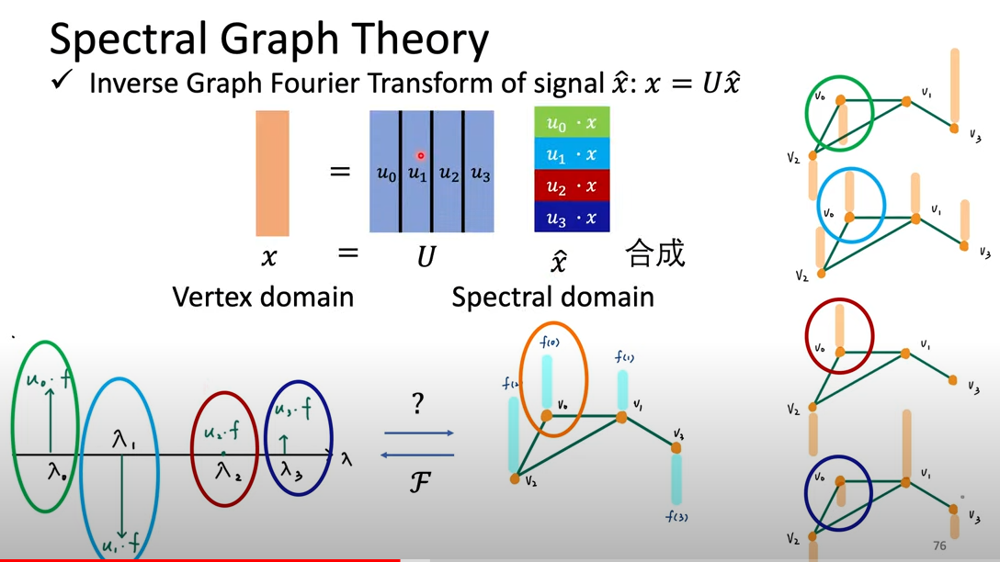

### 图神经网络

#### 为什么我们需要图结构？

对于一个单一的样本，我们当然也可以用一般的神经网络作为分类器来训练它，得到输出，但是实际中也会有这种情况，样本之间是存在联系的，我们在训练网络的时候也应该考虑这种信息，比如课件里面给的例子：

我们想要预测凶手是谁，不仅仅需要每个人的特征，也需要每个人和死者之间的关系，这样才能帮助我们更好的预测。

#### 如何利用结构和关系来训练模型？

对于单个节点来说，它可以从它的邻居那里学到结构，用所有邻居的特征来更新下一层的隐藏状态。

#### spectral-based convolution

1. **时域做卷积=频域相乘**
2. **卷积可以认为是一种滤波操作** 

首先定义一个图：$G=(V,E),N=|V|$，这个式子表示一个由节点（vertex，V）和边（edge，E）组成的图结构，结点的数量是N；

根据一个图可以得到该图的邻接矩阵$A\in \mathbb{R}^{N\times N}$，其中：
$$
A_{i,j}=0 \quad if \quad e_{i,j}\not\in E,else \quad A_{i,j}=w(i,j)
$$
目前我们只考虑无向图的情况（所以邻接矩阵是对称的），如果两个节点相连，则该位置的值为该条边的weight，否则为0。

根据一个图还可以得到该图的程度矩阵$D\in \mathbb{R}^{N\times N}$​​，该矩阵只有对角线上的元素有值，每个值表示该节点有多少个邻居。
$$
D_{i,j}=\begin{cases} d(i) &\mbox{if} i=j \\
0 &\mbox{if} i\neq j \end{cases}
$$
现在对于一个图来说，图上的每一个节点都可以看作是一个信号，即$f:V\to \mathbb{R}^{N\times N}$,$f(i)$表示该节点的信号。

根据一个例子来理解：

每个节点所对应的信号所表示的含义是自己设定的。

一个图的拉普拉斯矩阵为$L=D-A,L\ge 0$​,是一个**半正定矩阵**（对于每个非零实向量$X$​，都有$X^\prime AX\ge 0$,则称$A$​为半正定矩阵）​，同时$L$也是一个对称矩阵。

**在这里补充一下线性代数里面谱分解（spectral decomposition）的知识**

> 所谓的谱（spectrum）就是一个矩阵特征值（eigenvalue）的集合。特征值是一个矩阵将一个特殊的向量线性转换的程度，这个特殊的向量称之为**特征向量（eigenvector）**。

**特征值和特征向量**

> 给定一个矩阵$A$,$x$是非零向量，若存在一个数使$Ax=\lambda x$成立，则称$\lambda$为矩阵$A$的特征值，称$x$为对应于$\lambda$的特征向量

举一个例子，设$A=\begin{pmatrix}3 & 2\\ 2 & 0 \end{pmatrix}$，可以验证$u=\begin{pmatrix}2 \\ 1\end{pmatrix}$是对应$\lambda=4$的特征向量，即$Au=\lambda u$，而向量$u=\begin{pmatrix}1 \\ 2\end{pmatrix}$不是它的特征向量，因为找不到一个$\lambda$使上式成立。

**如何理解特征值和特征向量的物理含义？**

等式的左边，一个向量左乘以一个矩阵结果依然在$\mathbb{R}^n$的向量空间内，而在等式右边，$\lambda u$相当于对$u$线性的拉长了，却并未改变其方向。直观的理解是这样：对于方阵$A$而言，在$\mathbb{R}^n$​的向量空间内有些特殊的向量，这些向量能够在左乘$A$​之后，只做线性大小的伸缩，而方向上不做改变，站在矩阵$A$​的视角看，这种向量对于它自己而言是独特的，所以叫特征向量。如图：

**谱分解是什么？**

考虑一个$n\times n$的矩阵$A$，令$A$的特征向量构成的矩阵为$X=[x_1,x_2,...,x_n]$，与$X$​​中特征向量对应的特征值构成的对角矩阵为$\Lambda=\begin{pmatrix} \lambda_1 &0 &... & 0\\ 0& \lambda_2 & ... & 0 \\ ... &... &... &... \\ 0 &0 &... & \lambda_n\end{pmatrix}$，则有等式$AX=\Lambda X$​成立。（自己带进去检验一下就行）​​

如果$X$可逆的话，即$X$的列向量**线性无关**，上式可以化简为$A=X\Lambda X^{-1}$，即对于方阵$A$，能够对其进行谱分解的前提是$A$有$n$个线性无关的特征向量，这样他们构成的矩阵$X$才是一个可逆矩阵。​

**回到刚才的谱图理论**

一个图结构的拉普拉斯矩阵$L$，可以进行谱分解得到$L=U\Lambda U^T$，其中$\Lambda=diag(\lambda_0,...,\lambda_{N-1})\in \mathbb{R}^{N\times N}$，$U=[u_0,...,u_{N-1}]\in \mathbb{R}^{N\times N}$，列向量为标准正交。我们称$\lambda_l$为频率，$u_l$为$\lambda_l$所对应的基。

举一个例子来理解：

图中，矩阵$D$表示每个节点的相邻边的个数，矩阵$A$则表示不同位置处的邻接矩阵。

有点乱，如何理解上面的物理含义？

1. 矩阵$L$​是在图上的一个运算符，当一个图已知的时候，$L$就确定了，因为它是根据图的结构计算出来的
2. 给定一个节点信号$f$，$Lf$表示什么？
3. $Lf=(D-A)f=Df-Af$

如果我们只看一个entry的话，**$Lf$​的每个entry表示的是当前节点与其他相邻结点的能量差异，能量值一般用平方来表示，即$f^TLf$。**

如果从离散时间傅里叶（discrete time Fourier）变换的角度：

频率越大，说明信号越不光滑，相邻两点之间的信号变化量就越大。

根据上面低频到高频的图，$\lambda$​越小,两个相邻节点的能量差异就越小，$\lambda$​代表的是特征向量的频率大小。

$x=U\hat x$​是对时域上的$x$信号做傅里叶变换，$U$​矩阵的每一列都是一个基，不同的$\lambda$​值相当于不同的频率，而$\lambda$​对应的特征向量就是不同的基，在时域上面来说，一个图的不同节点的值$f$​就是在所有基上的累加和，这种形式跟时域的傅里叶分解，分量求和是一样的。

**滤波的概念**

如果将$\hat x$看作输入，$g_\theta(\Lambda)$看作是一个滤波器，其中$\theta$是$\lambda$的函数，则$\hat y$就是滤波之后的效果。

得到滤波之后的$\hat y$信号之后再进行傅里叶逆变换$y=U\hat y$.

我们的模型想要做的是，给定一个输入$x$,模型可以学到一组$g_\theta(\Lambda)$，从而实现信号的滤波。​

#### Graph Convolutional Network（GCN）

省略推导，GCN实现的是什么？

输入信号$x_u$及其所有的邻居经过参数变换后，取平均，然后再加上偏置，经过一个激活函数之后即为该隐藏层的输出。