### 结构化学习

#### 什么是结构化学习？

当输入和输出都是有结构的，而不仅仅是一个向量

比如：

1. 语音信号   -》 文本内容
2. 普通话 -》 英文序列
3. 句法分析   句子 -》语法树
4. 目标检测：图像 -》 目标框
5. 长文 -》 主题大意
6. 检索： 关键词 -》 搜索结果

#### 统一框架：

训练过程：

寻找一个目标函数$F$
$$
F:X\times Y\to R
$$
$F(x,y)$的作用是评估$x$和$y$​的匹配程度,可以认为是一种得分

测试阶段：

给定一个预测目标$x$，在目标函数中寻找使$F(x,y)$最大的$y$，即
$$
\tilde{y}=arg \mathop{\max}\limits_{y\in Y}F(x,y)
$$
现在换一种说法：

训练过程：评估$x$​与$y$​的联合概率密度$P(x,y)$​，现在的得分变成$x$与$y$同时出现的概率
$$
P:X\times Y\to [0,1]
$$
测试过程：给定一个目标$x$
$$
\tilde{y}=arg \mathop{\max}\limits_{y\in Y}P(y|x)\\
=arg \mathop{\max}\limits_{y\in Y}\frac{P(x,y)}{P(x)}\\
=arg \mathop{\max}\limits_{y\in Y}P(x,y)
$$

#### 存在的三个问题

1. $F(x,y)$应该是什么样子？他是如何计算$x$与$y$的匹配程度的？
2. 如何求解最大值？
3. 如何合理的评判$F(x,y)$就是我们想要的？

#### 隐式马尔科夫模型（Hidden Markov Model,HMM）

问题描述：给定一个序列，如何预测一个序列？

序列实际上是一种结构化的存在，包括其中的单词，词性，语法等

HMM模型给出了预测的一般步骤：

当我们想要生成一个句子时：

step1：先根据语法规则生成带有词性的句子主干

step2：基于词典对词性做补充，填充单词

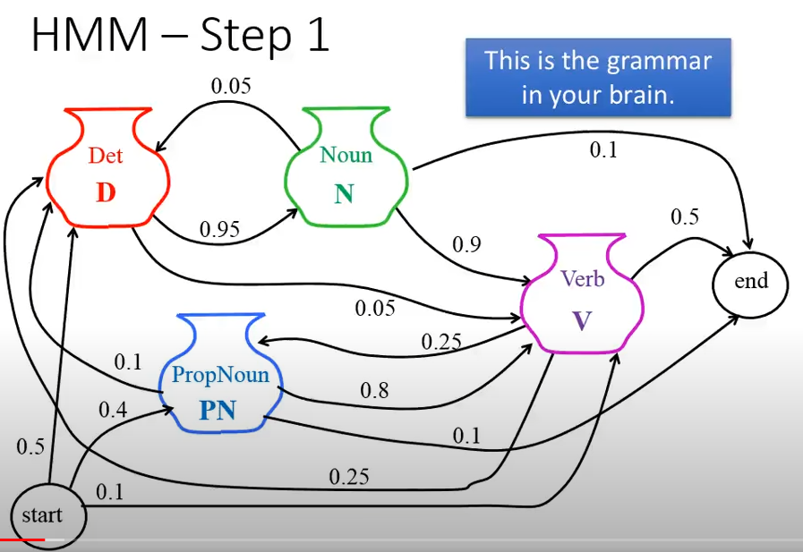

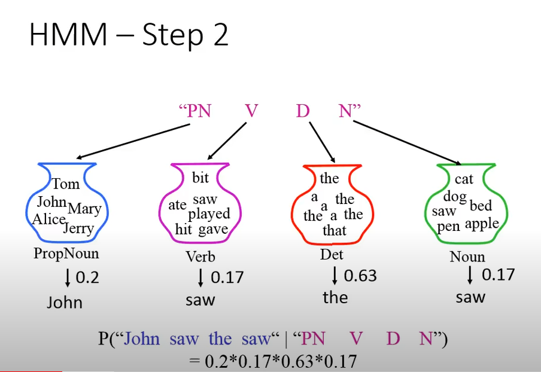

**现在的问题是什么？**

现在已经有了一个完整的句子，如何根据这个句子推导出句子的结构？这里说句子的结构实际上是指要推算出单词的词性。

一个很直观的想法就是**贝叶斯系列**

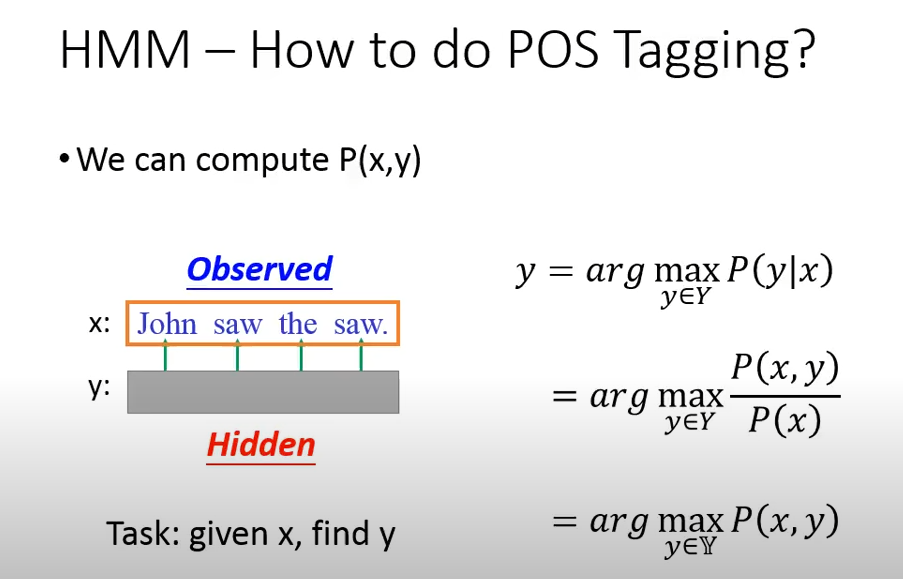

$x$是已经给定的，$y$是要预测的目标，实际上我们想要得到的就是在$x$的条件下获得哪个$y$的概率最大，所对应的$y$

对于有限的情况来说，我们需要穷举所有的$y$，选取对应的条件概率最大的那一个

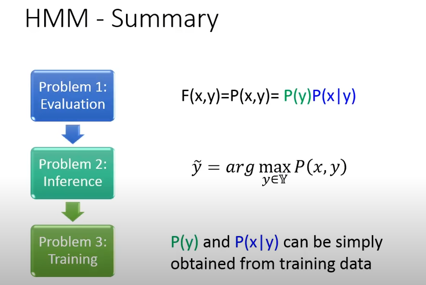

相对应地，训练过程应该是怎样的？

对于一组训练数据$(x,\hat y)$，应该有$P(x,\hat y)>P(x,y)$​

也就是说，网络应该最后训练出来这样的能力，真实值$\hat y$所对应的联合概率应该大于任意其他的$y$与$x$​同时出现的联合概率

#### HMM存在什么问题？

假如这是我们的训练数据：

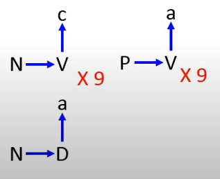

根据训练数据可以统计出
$$
P(V|N)=\frac{M(V,N)}{M(N)}=\frac{9}{10}=0.9\\
P(D|N)=\frac{M(D,N)}{M(N)}=\frac{1}{10}=0.1 \\
P(V|P)=\frac{M(V,P)}{M(P)}=\frac{9}{9}=1 \\
P(c|V)=\frac{M(V,c)}{M(V)}=\frac{9}{18}=0.5\\
P(a|V)=\frac{M(V,a)}{M(V)}=\frac{9}{18}=0.5 \\
P(a|D)=\frac{M(a,D)}{M(D)}=\frac{1}{1}=1
$$
现在有一个待预测序列的起点为$N$,根据上面的统计结果，下一个节点的值很大概率是$V$，这里没有问题，但是在选择下一个结点的时候，$P(c|V)$和$P(a|V)$的值是相等的，也就是说，下一个节点有可能是$a$，但是这种结构在我们的训练数据中是不存在的，即：

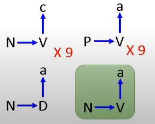

这并不是我们想要的，他会脑补他自己没见过的东西。（这对于对抗生成网络来说应该是件好事）

**但是：这完全是一个缺点吗？**

不是。如果我们训练的数据量很少，但是在真实世界中又确实存在他拟合的这种关系，这对于模型正确的拟合来说是件好事。

所以，当训练数据量少的时候，它的性能其实会比其他的要好。

#### 条件随机场（Conditional Random Field,CRF）的产生

$P(x,y)\propto \exp(w\cdot \phi(x,y))$​是怎么来的？
$$
P(y|x)=\frac{P(x,y)}{\sum_{y^\prime}P(x,y^\prime)} \\
其中\sum_{y^\prime}P(x,y^\prime)=P(x,y_1)+...+P(x,y_n)=P(x)
$$
此时
$$
P(y|x)=\frac{\exp({w\cdot \phi(x,y)})}{R}
$$
所以原式变成
$$
P(y|x)=\frac{\exp({w\cdot \phi(x,y)})}{\sum_{y^\prime \in Y }\exp({w\cdot \phi(x,y^\prime)})}=\frac{\exp({w\cdot \phi(x,y)})}{z(x)}
$$
上式中下面的一项是对所有可能的$y$求和。

#### 为什么说隐式马尔科夫和条件随机场是一样的？

在HMM中：(从物理含义上理解这里的$x$表示完整句子，$y$表示句子结构)
$$
P(x,y)=P(y_1,start)\prod_{l=1}^{L-1}P(y_{l+1}|y_l)P(end|y_L)\prod_{l=1}^LP(x_l|y_l)
$$
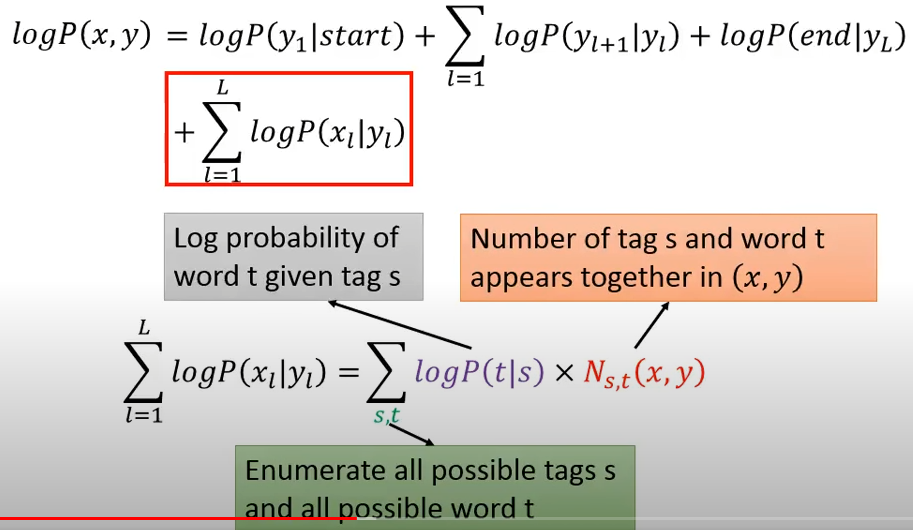

根据一个例子来理解：

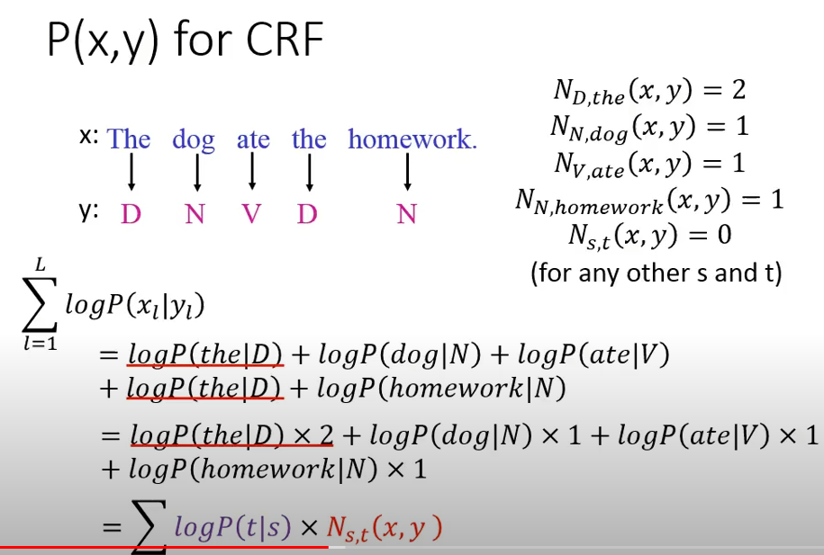

对于式子$\sum_{l=1}^L=\log P(x_l|y_l)=\sum_{s,t}\log P(t|s)\times N_{s,t}(x,y)$，$N_{s,t}(x,y)$表示某个word被标识成某个tag的次数。

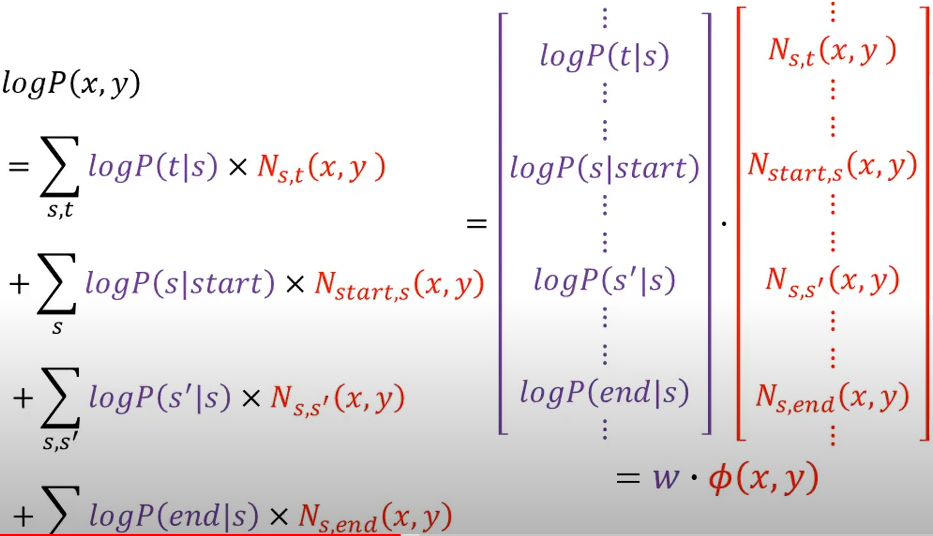

总结上图：
$$
\log P(x,y)=w\cdot \phi(x,y) \\
P(x,y)=\exp(w\cdot \phi(x,y))
$$
**这种做法存在什么问题？**

如果我们将$w$看作是网络的权重，在训练过程里实际上它可正可负，但是取log之后应该是负的。

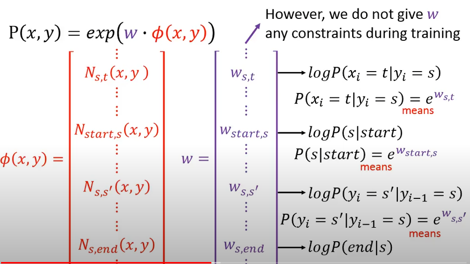

所以将$P(x,y)=\exp(w\cdot \phi(x,y))$更改为$P(x,y)\propto \exp(w\cdot \phi(x,y))$更合适。

#### 如何训练一个条件随机场模型

* 给定一组训练数据$\{(x^1,\hat y^1),(x^2,\hat y^2),...,(x^N,\hat y^N)\}$
* 找到一组权重向量$w^*$来优化目标函数$O(w)$

$$
w^*=arg \mathop{\max}\limits_w O(w) \\
O(w)=\sum_{n=1}^N\log P(\hat y^n|x^n) \\
\log P(\hat y^n|x^n)=\log P(x^n,\hat y^n)-\log \sum_{y^\prime}P(x^n,y^\prime)
$$

对于该目标函数，我们希望最大化前面的一项同时最小化后面的一项

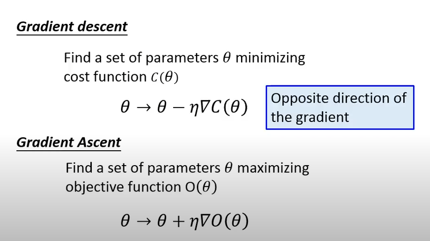

目标函数关于权重的梯度？
$$
\frac{\partial O^n(w)}{\partial w_{s,t}}=N_{s,t}(x^n,\hat y^n)-\sum_{y^\prime}P(y^\prime|x^n)N_{s,t}(x^n,y^\prime)
$$
 其中$N_{s,t}(x^n,\hat y^n)$​是根据观察数据可以统计到的，后面那一项$\sum_{y^\prime}P(y^\prime|x^n)N_{s,t}(x^n,y^\prime)$​可以通过Viterbi算法求解，这个式子有什么作用呢？对于前一项，在梯度上升的过程中，如果$x^n$​和$\hat y^n$​的匹配存在于数据集中，则对应的梯度会增加，如果出现了$x^n$​和$y^\prime$​的匹配，即不属于数据集中的，则梯度会减少。

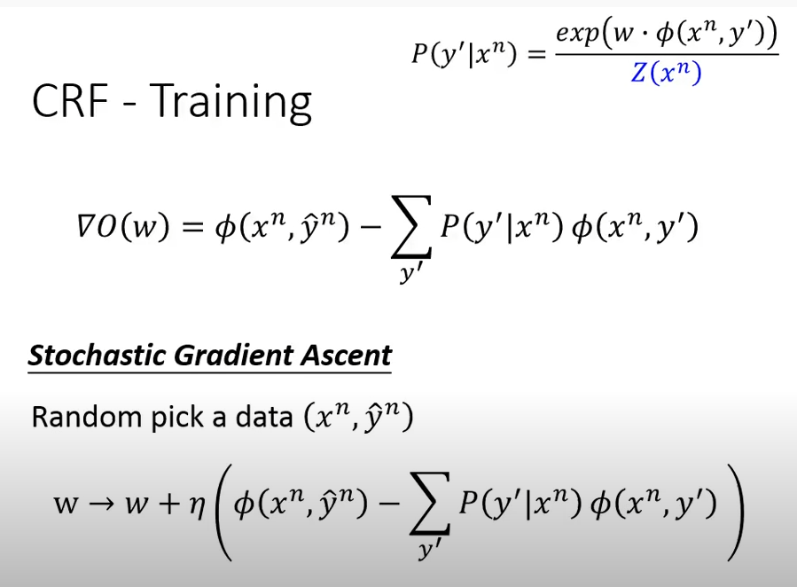

#### HMM和CRF的区别在哪？

HMM只根据数据集中已经存在的情况做统计，即它只关心$N_{s,t}(x^n,\hat y^n)$这一项，对于数据集中没有出现的匹配对，它不关心，所以会增加随机性

CRF既增加$N_{s,t}(x^n,\hat y^n)$的情况，又减少$\sum_{y^\prime}P(y^\prime|x^n)N_{s,t}(x^n,y^\prime)$即不匹配的对出现的情况，在训练过程中不会完全根据统计数据计算，而是会修改一些条件概率，使得不合理的情况出现的可能性减少。

